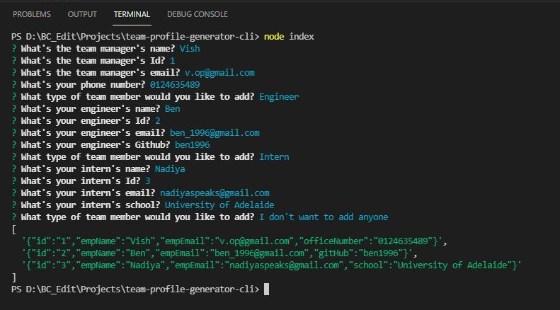

# Team Profile Generator

  [](https://opensource.org/licenses/MIT)
     
  ## Description
  This command line application (CLI) facilitates the user to create a web page for a software engineering team according to the given input. It saves a lot of time by generating the HTML markup text automatically, which otherwise need to be written manually by the user. This webpage does not include any seperate stylesheets, instead it uses Bulma CSS Framework. 
  
  ## Table of Contents
  * [Important Links](#Important-Links)
  * [Mock-up](#Mock-up)
  * [Installation](#Installation)
  * [Technical Acceptance Work Done](#Technical-Acceptance-Work-Done)
  * [Repository Quality Work Done](#Repository-Quality-Work-Done)
  * [Questions](#Questions)
  
  ## Important Links
  Following are the important links related to this application.
  * [Team profile generator - Github Repo](https://github.com/vish-opatha/team-profile-generator-cli)
  * [Walkthrough Video](https://drive.google.com/file/d/1vhYlg1mLTU8D2uR8s-dZn54WPvT2Ks2J/view?usp=sharing)

  ## Mock-up
  Following images shows the way of getting user inputs and the final README file that is created with the user inputs.

  *Command line for user input*

  

  ## Installation
  Before the user starts this application, user needs to install the necessary dependencies, and for that run the following command:

  ```
  npm install 
  ```
  ## Technical Acceptance Work Done
  This project is based on command line and the user is prompted with various types of questions by using the inquirer package. Those details are collected and handled by using Javascript and run using Node.js. Inquirer package is used to prompt the questions to the user in order to get the user inputs. There are a number questions prompted to the user,related to the repository to generate the team profile.

  Validation is used in getting the names, emails, school and telephone number correctly in all prompts. And according to the selection of type of the team, team member objects are created and pushed to the array. 

  ## Repository Quality Work Done
  1. Repository is named as team-profile-generator.
  2. Tags are indented accordingly and comments are included while following the best practices for naming conventions.
  3. Changes were committed multiple times with messages.

  ## Questions
  If you have any questions about the repo, open an issue or directly contact me at <v.opatha@gmail.com> You can find my other work at [vish-opatha](https://github.com/vish-opatha)
